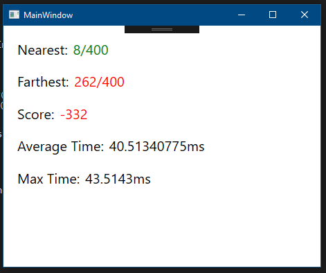

# 单机版黄金点游戏
这是单机版的黄金点游戏，使用者可以提供一段机器人程序。该程序应通过历史记录计算出新一回合要提交的数，并在400轮游戏中尽可能得更高的分数。

效果如下图：

# 什么是“黄金点”游戏？
请在邹欣老师的博客查看游戏介绍：[创新的时机 – 黄金点游戏](https://blog.csdn.net/SoftwareTeacher/article/details/25794525)

# 我们采用的游戏规则
……因为是通过历史数据复盘，所以玩家提交的数，只会被用于计算当前一轮的黄金点，但是不会在下一轮时作为历史数据出现。并且，每一轮游戏中时看到的历史黄金点，都是纯粹的历史数据，其计算不涉及玩家之前提交的数。这和联机游戏是有所不同的。

这一单机版的程序，是为了方便使用者了解、体验黄金点游戏，或测试自己的机器人程序。

# 如何让这个项目在机器上跑起来呢？
为此，我们需要：
- Windows 操作系统；
- Visual Studio 2017（推荐[免费的 Community 版本](https://visualstudio.microsoft.com/zh-hans/vs/community/)），并安装 ***.NET桌面开发*** 工作负载。
